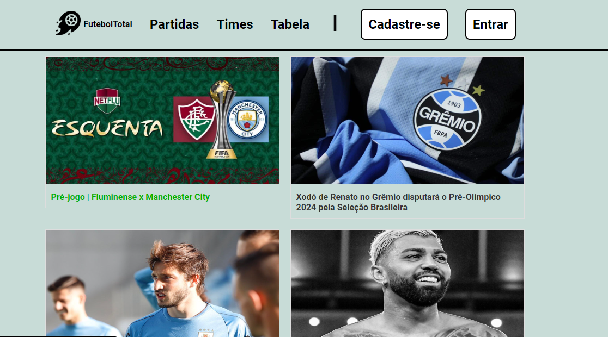

# PROJETO FUTEBOL TOTAL - CODEFICO

> Projeto consiste no desenvolvimento de um site de notícias e estatísticas sobre futebol, foi escolhido o campeonato brasileiro. O projeto foi desenvolvido durante o curso de programação web da Codefico/UFSJ. As tecnologias usadas no projeto foram: HTML, CSS, JavaScript, Next.js, MySQL.

### Ajustes e melhorias

O projeto está finalizado mas aberto a críticas, elogios e sugestões. As próximas atualizações serão voltadas nas seguintes tarefas:

- [ ] Melhoria no CSS
- [ ] Separação das partidas por rodadas
- [ ] Melhoria na apresentação das estatísticas
- [ ] Criação da página de estatística dos jogadores

## 💻 Pré-requisitos

Antes de começar, verifique se você atendeu aos seguintes requisitos:

- Um navegador instalado

## ☕ Usando Futebol Total:

Para usar o Futebol Total, siga estas etapas:

- Abra o link: https://futeboltotal.cloud/

## 📫 Contribuindo para o Futebol Total

Para contribuir com <nome_do_projeto>, siga estas etapas:

1. Bifurque este repositório.
2. Crie um branch: `git checkout -b <nome_branch>`.
3. Faça suas alterações e confirme-as: `git commit -m '<mensagem_commit>'`
4. Envie para o branch original: `git push origin <nome_do_projeto> / <local>`
5. Crie a solicitação de pull.

Como alternativa, consulte a documentação do GitHub em [como criar uma solicitação pull](https://help.github.com/en/github/collaborating-with-issues-and-pull-requests/creating-a-pull-request).

## 🤝 Colaboradores

Agradecemos às seguintes pessoas que contribuíram para este projeto:

<table>
  <tr>
    <td align="center">
      <a href="#" title="defina o titulo do link">
         
        
          <b>Hilário Grossi</b>
        
      </a>
    </td>
    <td align="center">
      <a href="#" title="defina o titulo do link">
         
        
          <b>Luís Gustavo</b>
        
      </a>
    </td>
    <td align="center">
      <a href="#" title="defina o titulo do link">
         
        
          <b>Mauro Chaves</b>
        
      </a>
    </td>
    <td align="center">
      <a href="#" title="defina o titulo do link">
         
        
          <b>Thayna Zacharias</b>
        
      </a>
    </td>
  </tr>
</table>
